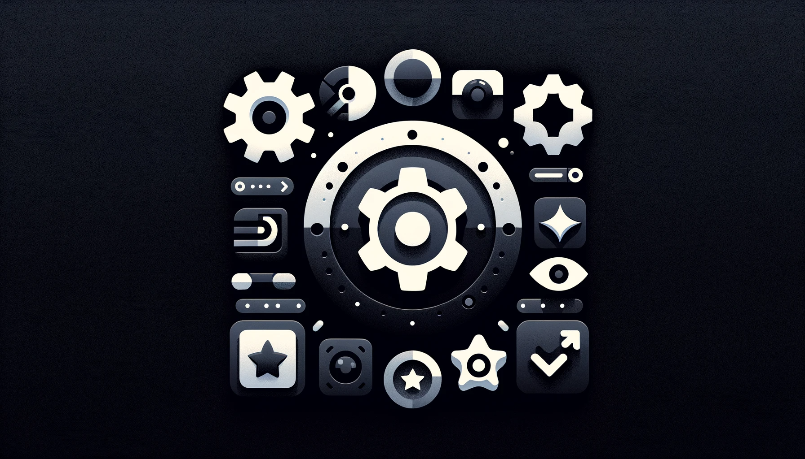

# Bem-vindo ao Mini Chatbot 🤖✨

<!-- load image from ./public/thumb.png -->

## Sobre o Projeto

Este projeto é um mini chatbot incrivelmente legal que você pode construir e personalizar! Usamos tecnologias super interessantes como NEXT.js 14, Tailwind CSS para deixar tudo bonito, Shadcn UI para componentes de interface do usuário e o poderoso Vercel IA SDK para dar vida ao nosso chatbot.

## Por que Participar?

- **Aprenda e Divirta-se**: Você vai aprender sobre desenvolvimento web moderno e inteligência artificial de uma maneira divertida.
- **Para Todos**: Não importa se você está começando agora ou já é um desenvolvedor experiente - este projeto é para você!
- **Construa Algo Incrível**: Ao final, você terá seu próprio chatbot funcionando!

## O que Você Vai Precisar

- Um pouco de curiosidade e vontade de aprender 😄
- Um computador com acesso à internet
- Alguma experiência básica em programação (mas não se preocupe, vamos guiar você!)

## Como Começar

# Como Começar

## 1. Configuração do Ambiente

Antes de começar, é necessário preparar o ambiente de desenvolvimento.

### Para Windows:

- Instale o [Node.js](https://nodejs.org/en/download/).
- Baixe e instale o [Visual Studio Code (VSCode)](https://code.visualstudio.com/download).
- Abra o terminal (Prompt de Comando ou PowerShell) para executar comandos.

### Para Linux e Mac:

- Instale o Node.js:
  - No Linux, use o gerenciador de pacotes da sua distribuição. Por exemplo, no Ubuntu: `sudo apt-get install nodejs`.
  - No Mac, use [Homebrew](https://brew.sh/): `brew install node`.
- Instale o [VSCode](https://code.visualstudio.com/download).
- Utilize o Terminal para comandos.

## 2. Clonar o Repositório

Para obter o código do projeto:

- Se você já tem um conta no github: `git clone https://link-do-seu-projeto.git`.
- Para quem não tem uma conta no github, pode cria uma [GitHub](https://github.com/).

## 3. Instalar Dependências

Após clonar o projeto, instale as dependências:

- Abra o terminal na pasta do projeto.
- Execute `npm install` (ou `yarn install`, se estiver usando Yarn).

### Iniciar o Projeto:

- Execute `npm run dev` (ou `yarn dev`) para iniciar o servidor de desenvolvimento.
- Acesse `http://localhost:3000` no navegador para ver o projeto.

## 4. Explorar o Código

Familiarize-se com a estrutura do projeto. Aqui está uma visão geral:

- **README.md**: Documentação geral do projeto.
- **STEP_BY_STEP.md**: Este guia passo a passo.
- **app**: Pasta principal da aplicação.
  - **api/chat**: Contém a lógica da API do chat.
  - **globals.css**: Estilos globais.
  - **layout.tsx e page.tsx**: Componentes principais da página.
- **components**: Componentes React do projeto.
  - **Chat.tsx**: Componente principal do chat.
  - **ui**: Componentes de interface do usuário como botões, avatares, etc.
- **lib**: Bibliotecas e utilitários, como `utils.ts`.
- **public**: Recursos públicos como imagens e ícones.
- **next-env.d.ts**: Arquivo de definição de tipos para Next.js.
- **next.config.js**: Configurações do Next.js.
- **tailwind.config.js/ts**: Configuração do Tailwind CSS.
- **package.json**: Lista de dependências e scripts.
- **yarn.lock/package-lock.json**: Arquivos de bloqueio de dependências.

Explore cada diretório e arquivo para entender como os componentes são organizados e como a aplicação é montada. Isso dará uma boa base para começar a desenvolver e contribuir para o projeto.

## Construindo o Chatbot

- **Passo 1**: Configurando o NEXT.js e entendendo o básico.
- **Passo 2**: Estilizando com Tailwind CSS. Vamos fazer nosso chatbot ficar lindo!
- **Passo 3**: Adicionando componentes de interface com Shadcn UI.
- **Passo 4**: Integrando a Vercel IA SDK para dar inteligência ao nosso chatbot.

## Dúvidas e Suporte

Se você tiver dúvidas ou precisar de ajuda, não hesite em perguntar,
me adicione em todas as redes sociais como @vitormalencar

- [Twitter](https://twitter.com/vitormalencar)
- [Instagram](https://www.instagram.com/vitormalencar/)
- [Linkedin](https://www.linkedin.com/in/vitormalencar/)

## Contribua

Adoraríamos ver suas contribuições e ideias! Sinta-se à vontade para fazer fork do projeto e experimentar.

## Vamos Construir Algo Incrível Juntos! 🚀
